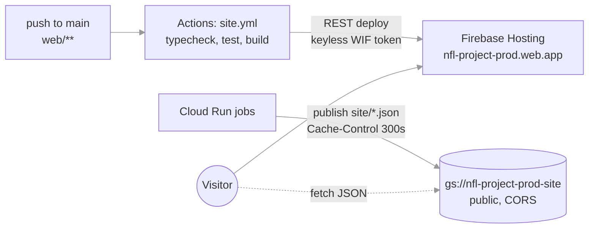

# The public site (M7.4, M7.5; v2 layout M10)

Status: current, verified 2026-11-13 for the player pages (M24.6) and the team Health tab with its field view (M24.7 round 3), the rest 2026-11-09 against `web/` after the books section (M20.13); the ADR 0028 sections are planned.

A static React app on Firebase Hosting that reads the published site JSON from the public bucket. Decisions: ADR 0009 (static site, no API), ADR 0015 (data from a public bucket, so data changes never need a deploy). The Streamlit app stays as the local explorer; this replaces it as the public face.

## How it fits

```mermaid
%%{init: {'themeVariables': {'signalColor': '#999', 'signalTextColor': '#999', 'lineColor': '#999'}}}%%
flowchart LR
    JOBS[Cloud Run jobs] -- publish site/*.json<br/>Cache-Control 300s --> BUCKET[(gs://nfl-project-prod-site<br/>public, CORS)]
    PUSH[push to main<br/>web/**] --> GHA[Actions: site.yml<br/>typecheck, test, build]
    GHA -- REST deploy<br/>keyless WIF token --> FB[Firebase Hosting<br/>nfl-project-prod.web.app]
    USER((Visitor)) --> FB
    USER -. fetch JSON .-> BUCKET
```

- **App:** `web/`, Vite + React 19 + TypeScript, React Router, TanStack Query (fetch + cache), zod (runtime contract checks), Tailwind 4 (layout), Recharts plus small hand-written SVG charts (dot-and-whisker, dumbbell, diverging bars) on `d3-scale`. Vitest + Testing Library.
- **Data:** `VITE_DATA_URL` (default `https://storage.googleapis.com/nfl-project-prod-site`). Pages fetch `site/meta.json`, `site/slate_<season>_<ww>.json`, `site/game/<id>.json`, `site/tracker.json`, `site/hypotheses.json`, `site/coaches.json`, `site/diy_matrix.json`, `site/season_<yyyy>.json`, `site/audit.json`, and lock artifacts under `predictions/`. In `npm run dev`, a small Vite plugin serves the local `data/marts/site` at the same paths, so the app runs against your laptop's data with no bucket.
- **Contract:** TypeScript types and zod schemas in `web/src/data/contract.ts` mirror `src/nfl/site.py`. A test parses every real JSON file under `data/marts/site` (skipped when absent) and checked-in fixtures (always), so a contract change in Python that breaks the site fails CI.
- **Build-your-own in the browser:** the evaluator (walk-forward Platt, metrics, buckets, season view, fit-toward-you ridge) is ported to TypeScript in `web/src/diy/`. A parity test compares it with Python's `nfl.approaches.diy.evaluate` on fixed weight sets (fixtures generated by `scripts/web_fixtures.py`).
- **Contract: `league.json`** (ADR 0019, schema "1", `LeagueFile` in `nfl/league/build.py`): `season`, `as_of`, `through_week`, `n_sims`, `seed`, `shock_sigma`, `tiebreak`; `teams[]` standings rows with `seed_today` and `div_rank`; `odds.student` and `odds.market`, each `{sources, teams{code: {playoffs, division, bye, seed[7], rounds{div, conf, sb, champ}, wins{mean, lo, hi}}}}`; `games[]`, every remaining game by leverage, with `p_student`, `p_market`, `market_source`, `swings[]` from the Student's runs and `n_home_wins`, `n_away_wins`; `history{code}` from the Tuesday snapshots; similar seasons are in their own file. Written last in `site.build`, in its own try/except. `through_week` is the last week with every game final. A rebuild with no new data is identical apart from the timestamps. Results arrive by the 07:00 retro ingest, so a game can sit in `games[]` after it ends: the page keeps only games with a kickoff still ahead. After the last regular-season game the file keeps the final standings with no odds or games. M26.2 (ADR 0029, additive): `played[]` (every finished regular-season game: `week`, `home`, `away`, `home_score`, `away_score`, canonical codes) and each variant's `ratings{code}` and `home_term`, which the browser's what-if needs to rebuild standings, break ties and price playoff games (about 12 KB). The browser engine is `web/src/lib/league/` (a copy of `standings.py`, `tiebreak.py`, `simulate.py` without leverage, run in a Web Worker by `client.ts`); `scripts/league_parity.py` writes its parity fixtures (`web/src/test/fixtures/league_parity/`), and `tests/test_league_simulate.py` fails when `sim.json` is stale.
- **Contract: `similar.json`** (ADR 0019, schema "1", `SimilarFile` in `nfl/league/build.py`): `measures[]` (the seven axes) and `teams{code}`: `games_played`, `record`, `k_summary`, `made_playoffs`, `rounds`, `pool{seasons, n}`, `profile[]` (percentile by `measures` order, 100 is best, or hardest for Schedule), `nearest[]` (25, each with `profile`, `closest`, `furthest`; the page lists ten) and `flags[]`. Its own file so the slate doesn't load it, written after `league.json` in its own try, so on a failure the last file stays. A team under four games played has no entry.
- **Deploy order (ADR 0023):** on `main`, a new image rebuilds the site data (`nfl-site`), then `npm run test:live` parses every kind of live file with this commit's contract, then the web deploys. Run `npm run test:live` locally to check a contract change against production.
- **Matchups and paths to an upset (ADR 0028, M25, planned):** game files gain `matchups` (per side, per situation: the opponent's habit on the league band, the rate already faced, this unit's shrunk result with n, the edge in points, a reliability badge), `paths` (the underdog, five in-game conditions with the historical win rate of dogs this size who met them, each team's season-to-date rate, a plausibility label, a template sentence; outcomes once the game is final) and `lean` (the ledger's `use` candidates against the market, in points with a CI); `team/<code>.json.splits`; `tracker.json.leans`. The game's Tendencies tab is relabeled Matchups (`MatchupGrid`), the Preview gets `UpsetPaths` under "Who has the edge", and "Where we differ from the market" shows the lean. None of it moves the headline chance.
- **Predictions against the market (ADR 0024, M20):** game files gain `market_history[]` (pre-kickoff consensus points: `ts`, `spread_home`, `total`, `p_home`, `n_books`; never a snapshot after kickoff), `market_events[]` (what changed in the same window: QB1 changes, injury status changes, results, notes, locks; never "because"), `swings[]` (`kind` qb, injury, coaching, rest or weather; the QB what-if carries `assumed`/`alternative` with every approach's rescored `p_home`), `strong_calls[]`, `today` (the latest preview score: labelled "preview, not locked", never graded) and `expected_score` (`total`, `sd`, `market_total`, `home`, `away`: the locked total split by the Student's spread). `books` (M20.13: each fresh book's `spread_home`, prices, `total`, `p_home` at the latest pre-kickoff snapshot; `spread`/`total` ranges with `lo`, `hi`, `median`, `gap`; `key`, the key spread they straddle; `flags` `spread_gap`, `spread_key`, `total_gap`; `n_stale`). Slate rows gain `line_move`. `tracker.json` gains `strong_calls` (`gap`, `first_lock`, `record[]`, `calls[]`) and `totals` (`first_lock`, `weeks`, `n`, `mae`, `market_mae`, `side_right`, `side_n`). All nullable or defaulted. On the page: "The line" tab after the Preview, shown once there are two snapshots or three books: "How the line moved" from the second snapshot on (`LinePath`: spread and total charts zoomed to the data with labelled gridlines, the favored team's tint, pick'em when the line is within 3 points of it, the Student's number dashed, lock and event marks; events outside our snapshots listed apart; the move since first seen and since the lock; today beside locked), then "What each sportsbook says" (the read, flagged when they disagree; `BookStrip`, a dot per book on the spread and the total with the median and key numbers; the table with prices; a dot on the tab when they disagree), "Where we differ from the market" on the Approaches tab, the strong calls' outcome on the retro tab, the pick tile's spread and a fifth pregame tile "Expected score" once a lock has a total; the slate card's move phrase and spread beside the pick; the tracker's "Strong calls" tab with the "Totals, new" block under it.
- **Contract: `team/<code>.json`** (ADR 0021, 0022, schema "1", `TeamFile`, built by `nfl.staff_context.team_files` in every current-season site build): `staff.current` and `staff.changes` (play-caller rows only when confirmed; `replaced`), `units.off|def.caller` (`name`, `confirmed`, `situation`, `career`, `traits`), `units.*.live` and `.charted` (per measure: `observed`, `team_last`, `caller_past` with `rank`/`of`, `lean`, plus the older `expected`, unused by the page), `other_starter_weeks`, `through_week`, and `profiles` (sourced known-for and tree from `data/coach_profiles.csv`, never who calls plays).
- **Contract: `teams.json`** (ADR 0019, schema "1"): `season`, `week` (the next week to be played), `as_of` (the feature build time), `features[]` in registry order (`id`, `label`, `short`, `description`, `unit`, `group`, `group_name`, `better` higher, lower or null for no good or bad, `n`, `mean`, `lo`, `q1`, `med`, `q3`, `hi`), and `teams{code}` (`conference`, `division`, the record, `through_week`, `games[]`, `values{}`, `pct{}`, `rank{}`). Values are each team's row for its next game as of the last feature build, so they change with the features and not when a game kicks off; the record stops at the same point. A missing value is an absent key. A 404 shows an empty card, because the file is published by data jobs and the page deploys on its own.
- **Deploy (M7.5):** `scripts/firebase_deploy.py` uses the Firebase Hosting REST API (create version with config, populate file hashes, upload gzipped files, finalize, release) with a token from `gcloud auth print-access-token`. That's keyless in Actions (Workload Identity, the existing `nfl-deploy` service account has `firebasehosting.admin`) and works locally with your gcloud login. Chosen over the Firebase CLI because current CLI releases have open reports of ignoring Workload Identity credentials in CI, and the official deploy action still needs a stored key. Hosting config sent with each version: SPA rewrite to `/index.html`; `Cache-Control: public, max-age=31536000, immutable` for hashed `/assets/**`, `no-cache` for HTML; a CSP that allows fetches only from self and `storage.googleapis.com`.
- **Workflow:** `.github/workflows/site.yml`, called by `ci.yml` after both test jobs pass on a push to `main` touching `web/**` (and manual dispatch): `npm ci`, typecheck, lint, test, build, deploy. `ci.yml` gains a web job (typecheck, test, build) for pull requests.

## Pages (mirror the Streamlit ones, with the React-only items from `.notes/ui-feedback.md`)

| Route | Page | Reads |
|---|---|---|
| `/` | Slate: one plain sentence on what the site is, last week's record, the week's games × approaches with the Student's pick on each card, divergence markers, statuses, disagreement strip; **your picks** (M26.1, ADR 0029): a pick row under each card and a larger one under the game page's header until kickoff (`components/YourPick.tsx`: team-colored fill with a check when picked, the other team dimmed, a hover tint and a short pop zeroed under reduced motion) and a strip with your record against the Student and the market's favorite on the same games, stored in `localStorage` (`lib/picks.ts`) | meta, slate (and the slates of every week you picked), last week's recap |
| `/game/:id` | Game: approaches vs market, why (group contributions in win-probability points), edges by group, tale of the tape, tendency dumbbells vs league, injuries (led by `FormationMap` for unplayed games, ADR 0027: each side's base-formation starters, ring sized by value in points, the empty part of the ring the value at risk, dashed for unvalued linebackers and interior linemen, Q/D/O badges, a note before any game status; then the scored key players; then the report), narrative v2 | game |
| `/tracker` | Season tracker: gap to the market by week, backtest Δ with CIs, log loss by season, disagreements, calibration, paper bets (bankroll, return per bet, season grid), persona vs history; the Strong calls tab also holds Player claims (ADR 0027): said vs moved for each graded claim | tracker, meta |
| `/hypotheses` | What history says per feature; one feature or group over time | hypotheses |
| `/league` | League (ADR 0019, M14): a summary strip when `league.json` loads, then Playoff odds (the default; a projected bracket by default, `?layout=table` for the table (Austin, 2026-11-12; `pages/league/bracket.ts`: seeds by the exact assignment that maximizes the summed P(seed), each game to the team more likely to win its round, the NFL's reseeding; each team shows its chance to win that round, its record and its projected final record; with room (about 1,040 px) AFC and NFC face each other with the Super Bowl in the middle, narrower they stack; connector lines are measured from the boxes because the NFL reseeds; "Next in line" lists the next three; in What if mode the decide panel is a strip above it); both conferences on one page, AFC then NFC (in a scenario, the biggest mover's conference first); the market by default, the Student with `?view=student` (Austin, 2026-11-12; `?conf=` is ignored); M26.4: a Published / What if… switch, `?whatif=1`, that puts a game list beside the table (by week, or by team with "wins out", "loses out" and clear for that team's remaining games; decide either team, your saved picks applied with a switch, favorites win out, reset, copy link; `?d=<game_id>:<TEAM or ->`, `fav=1`, `mypicks=0`) and turns each cell into the what-if value with an arrow from now and a gray tick at now; both columns from the browser's engine on one seed, `pages/league/whatif.ts`, `useWhatIf.ts`, `WhatIf.tsx`) · Team charts (`?tab=teams`: scatter of any two features, 32 teams, presets, find a team, team panel) · Standings · Games that matter (the next week by leverage, then the ten biggest later games) · Similar seasons (`?team=`; descriptive: a finish grid of the 25 nearest seasons, flag cards, an overlap chart across seven measures, the ten nearest with what matched). Team charts also holds Compare (`?team=&vs=`, every published measure as a dumbbell on the league band) and Show the ranks (sortable). Playoff odds draws a sparkline per team once `history` has two Tuesdays. Team charts works without `league.json`. League prints rates to a decimal and a gap in a rate as a percent, because "pts" elsewhere means win chance | teams, league |
| `/team`, `/team/:code` | Teams (ADR 0022, M18), in the nav after League: all 32 by division, then one team's page with a picker; old and lower-case codes redirect, keeping `?tab=`. A Health tab (M24.7) when the file has `health`, which replaced the Availability tab (`?tab=availability` redirects): share of full strength going into the next game with a summary tile, a bar per position group with who's missing, the full-strength lineup on a field (`charts/DepthField.tsx`, round 3: ★ for a key player, a dashed ring with a badge when out and who steps in under it, the window and the chart behind him in the tip; room cards on a phone; no player values shown), the share in spot weights with starters out and how many are key, the scored claims' sentences once the report is in, and a by-week line (games so far solid, the outlook dashed). Before Friday's game statuses, a starter who missed or was limited in practice is shown as in doubt (named in a note, striped in his group's bar) but not counted in the share | teams, league, similar, team/<code> |
| `/coaches` | Team view and coach view of coordinator scheme profiles. **Hidden on the live site** (M16) | coaches |
| `/build` | Build your own: group budget, donut by heading, results; shareable `?w=`. **Hidden on the live site** (M16) | diy_matrix, meta |
| `/season/:year` | Every game of a season under a weight set | season_<yyyy>, diy_matrix |
| `/method` | How it works, honest limits, leaks found, freshness, audit | meta, audit |

Hidden pages: `lib/hiddenPages.ts` lists pages kept off the live site. `isHidden` is false in `npm run dev`, so they can be worked on; in a build they leave the nav, their routes render `NotFound`, and any link to them checks it too. Nothing else changes: the code and the data files stay. A new link to a listed page has to check `isHidden`.

Global: page titles per route (`Page`'s `docTitle`; tabs and bookmarks only, link previews read `index.html`), `/hypotheses` is labeled History in the nav, matching its title "What history says" (it was Evidence until 2026-11-07, when two site-walk personas expected the evaluation there), Help tips open by tap, hover or keyboard and stay on screen (fixed position), header nav, "last updated" from `meta.generated_at` and the last lock, footer with credits and the "fan-made, not affiliated with the NFL" line, light/dark theme from the dataviz palette tokens, hover help on every feature/group/metric (descriptions from `meta.groups`), mobile-friendly layouts (tables scroll horizontally, charts reflow).

## Work order

1. **Foundation (main session):** scaffold, data layer + contract + fixtures, design tokens and shared components (Help, Section, StatTile, ModelBadge, StatusBadge, ProbCell, chart kit), app shell and routes with placeholders, dev data plugin, tests. Tendency metric labels added to `meta.json` (a contract gap the Streamlit pages hard-coded).
2. **Pages (four implementer agents in parallel):** slate + game; tracker + method; hypotheses + coaches; build-your-own + season + the TypeScript evaluator with its parity test.
3. **Deploy (main session):** the REST deploy script, `site.yml`, the CI web job, a local `npm run build && preview` check.
4. **Review, then first deploy:** a reviewer pass over `web/`, then (with Austin's go-ahead, since it publishes) a first manual deploy and the push that turns on the workflow.

## v2: one answer first (ADR 0017, M10)

Decided 2026-11-03 after the retrospective made the game page 21 sections long. Every page opens with a summary strip (3–5 tiles, each one statement, linking to the tab that explains it) and keeps its detail behind URL-synced tabs (`?tab=`). Sections keep their content and lose their duplicate explanations (one lede sentence, help on hover, one fine-print block per page). Values are drawn on a league band (p10–p90 of team season-to-date values) with the number printed at the row end. The slate becomes matchup cards with a compact approaches-vs-market strip (`?view=table` keeps the grid). Team colors appeared as a thin accent bar only (replaced by the ADR's amendment, below). Shared pieces: `Tabs`, `SummaryStrip`/`Tile`, `FinePrint`, `RangeRow`, `ProbStrip`, `TeamAccent`.

| Route | Summary strip | Tabs (`?tab=`) |
|---|---|---|
| `/`, `/week/:season/:week` | week recap: best approach, vs the market, picks right, biggest upset, luckiest team (finished weeks) | none; cards sort by `?sort=kickoff\|disagreement\|upset` (`disagreement` is labeled Student vs market), `?view=table` for the grid |
| `/game/:id` | pregame: the pick, vs the market, biggest factor, key absence or biggest edge; finished: result, approaches right, played like, swing plays, biggest surprise | `retro` (finished games with a retro; default), `preview` (default otherwise), `approaches`, `tendencies`, `details`, `news` |
| `/tracker` | the Student vs the market, live games graded, best approach, calibration, paper bets | `season`, `backtest` (also log loss by season and disagreements, which span every season), `calibration`, `bets` |
| `/hypotheses` | none | `time` (default; `?item=` picks the feature), `effects` |
| `/team/:code` | playoff chance, who calls the offense, who calls the defense, biggest change from last season, next game | `overview` (default), `staff`, `tendencies`, `games` |
| `/method` | none | `how`, `limits`, `data` |

The Student is the headline line (`HEADLINE` in `lib/models.ts`; D5): the pick, the slate's status, the recap's picks right and the tracker's tiles read it. The ensemble is a diagnostic: `data/hideEnsemble.ts` strips it from every file at load, so pages never see it, and it is a no-op once the data has none. The game page is built around the game (round 2): `preview` is approach-free, one bar per group sized by the Global fit and no approach picker (since 2026-11-07; the picker moved to `approaches`, where "Why they lean" outlines the fit's value on each approach's bars). Groups the fit can't price because they are live only (`market`, `buzz`) follow as raw readings in a "Live only" table (`liveOnlyGroups`). The name "Global" never appears on either tab. Groups come from `meta.groups`, and a group the fit has no bar for is no bar; `isContextOnly` in `lib/meta.ts` keeps `coaching`, `off_scheme`, `def_scheme` and `matchups` out of the bars, the edges and the Biggest edge tile (and out of the Preview altogether: Austin, 2026-11-07, doesn't want a number attached to them yet; they stay on Details and Tendencies, where the differences are drawn without a value), reading `context_only` from meta plus a fallback set to delete once that field ships. `details` draws both teams on the league's band (`MatchupBand`, `meta.feature_bands`): faint from p10 to p90, solid over the middle half, a tick at the median. Further right is better, and a gap wider than the league's middle half stands out while the rest are muted. A push toward a team is always a plus (`ptsFor`, `ptsSide`): the side says whose it is. The outline is one neutral ink, since color on those bars means a team. `useChartTip` is the hover card on `MatchupBand`, `DivergingBars`, `Dumbbell` and `RangeRow`, on hover and keyboard focus.

Color (ADR 0017 amendment): on a game page and a slate card, `[data-matchup]` with `matchupVars(away, home)` sets `--team-away` and `--team-home` for the theme, so use those and never a raw brand color. The League scatter uses the same slots for one team: `teamDotVars(code)` puts the main color in `--team-home` (the fill) and the second brand color in `--team-away` (the ring), because one color can't separate 32 teams. `lib/teamColors.ts` fits the brand colors and picks the pair; `teamColors.test.ts` holds all 992 matchups to contrast and colorblind floors. `--div-pos` and `--div-neg` stay for better and worse, helped and hurt.

The retro leads with the game too: tiles run result, played like, swing plays, biggest surprise, approaches right, and headlines don't mention approaches. Played like shows what goes into it: EPA per play decides it, success rate is context (`expectations.py` says why). Phase by phase is the wider view: who won passing, rushing, explosive plays, third downs, the red zone, special teams, field position and turnovers. It's description, not a score, and none of it feeds the verdict; each row comes from `phases` in the record, computed by `_phases` in `retro/game.py`. Swing plays are one bar per factor, home's swing minus away's, split into Variance and Pure luck by `partly_skill` on one shared scale. Global isn't shown in the retro or the recap table.

The retro's first chart is **How it unfolded** (`WpChart`, ADR 0020): `wp_series` from nflfastR's spread-adjusted win probability, home at the top, each team's area in its color, numbered turning points in time order, and the same plays in a "Turning points" list so nothing is hover-only. A point is the value after the play snapped at `t`, so a mark sits on the line. The lede and the ring name the winner's low only when it came after kickoff and was under 25%: an underdog that only rose never "fell" there. A swing is the difference of the two rounded percents, so a row's arithmetic holds. "Swing plays" stays the luck section; the two names are not interchangeable.

`PossessionStrip` sits under the curve on the same time axis (`timeScale` in `charts/wpScale.ts`, which both charts read, so a drive can't drift from its stretch of the curve): a segment per drive running to the next drive's start, a line at each score. **Drive by drive** (`DriveField`) is one row per drive on a field with the away team's goal on the left, so the away team drives right and the home team left, whichever ends they really used. Bars use `drive_start_yard_line`, and a touchdown runs to the goal line because `drive_end_yard_line` is the last snap. The strip's segments take hover and tap but no tab stop; `DriveField`'s rows carry the same drives for the keyboard.

A finished game keeps its result on screen: `Condensed` in `SummaryStrip.tsx` watches the full strip with an IntersectionObserver and, once it has left through the top, shows one line under the site header (`PinnedResult`: the score, OT, the result tile's verdict). The header's height is measured, not assumed. The shell has no height, so nothing moves when it appears, and it's hidden from screen readers because the page header says the same. Tabs' `scroll-mt-32` leaves room for it when a tile scrolls a panel in. Pregame pages have no result to pin.

Slate cards lead with the game too: teams, the line and total, a **why this game** line, a tendencies contrast when it's stark, then the approaches strip. `whyLine` and `contrastLine` in `slate/helpers.ts` build them from the row's `card` block (`_card` in `site.py`). Everything in that line is a public claim, so the rules are strict:

- **Quarterbacks.** Neither the schedule's name for an unplayed game nor the depth chart is reliable alone, so the card needs both, for the current week only, before kickoff. It says "listed to start" when they agree and "starter unclear" naming both when they don't. A hurt player drops out of the comparison. "Usually" needs three starts and a clear lead, and a QB who started the team's last game isn't news.
- **Absences.** Only a player listed first at a position on the chart for that game (special teams excluded, matched by player id), and not Out or Doubtful at the team's last game.
- **Edges.** `countsAsEdge` in `lib/meta.ts`: not context groups, not Venue & weather (it only shifts home advantage), and not Rest & travel on a neutral site, where it favors the nominal away team. The Preview keeps their bars and drops their labels. On a neutral site the Preview moves the neutral-site discount onto the Home field row, which can go negative, and an approach without that feature (the Sharp) keeps its full value; the Approaches tab shows the raw pieces.
- **Card contract.** A bad `card` costs that game its line, with a console warning, not the week its slate. `contract.test.ts` validates cards and the injury flags, so wrong types and a dropped flag fail there.

The tracker's season chart plots each line's gap to the market (market cumulative log loss minus the line's, so above zero is ahead), with a band at ±0.025 for gaps too close to call: `GAP_BAND`, the 90% range of a gap over 120 games, which narrows as games accumulate. References (`REFERENCES` in `lib/models.ts`) draw as a dashed ring in `Swatch`, so in tables and toggles, and `ModelBadge`'s `reference` prop adds a tag in tables. A list built from a data file filters with `isPublicLine`, so diagnostics never appear because the file carries them. The week recap's Full recap names the week's best call and costliest miss, from `best_call` and `costliest_call`.

Tile values are pure functions of the site JSON (`pages/*/summary.ts`, `slate/recapTiles.ts`), unit-tested. Within 5 points of even, results and played-like are called a toss-up, and on the tracker, log-loss gaps under 0.025 are "about the same" (`GAP_BAND`; a week's recap tile uses 0.005 and only describes that week).

## The design language (decided 2026-11-03, ADR 0017; the rules every page follows)

Why: with the retrospective added, a finished game's page was 21 stacked sections, each with a paragraph, hover help, a chart and a table; the slate was a 10-column table; charts auto-scaled so a small gap could fill a row and nothing said whether a value was good. Three flows were weighed (tabs plus a summary strip; a guided one-frame-at-a-time story; a dashboard of tiles with drill-down panels) and the first won: every section reachable in one click and shareable by URL, with the story's discipline inside each tab.

1. **One answer first.** Every page opens with a summary strip of up to five tiles. A tile is a statement (an upset or not, how many approaches were right, the biggest surprise), never a restated number; its sub-line is six words; it links to the tab that explains it. Tile values are pure functions of the site JSON in `pages/*/summary.ts` and `slate/recapTiles.ts`, unit-tested.
2. **Detail behind URL-synced tabs** (`?tab=`, history replaced, not pushed). A finished game opens on its retro; a pregame game on its forecast.
3. **Text budget** (tightened 2026-11-08, ADR 0017 amendment, M21). A lede is one sentence of about 15 words on what you're looking at, or none; how to read a chart goes in hover help or a legend; caveats in one `FinePrint` per tab or page; hover text at most 30 words; nothing said twice on a screen; three or more parallel sentences become a table or a `label · number` list; teams by code in sentences; no timestamps, model names or ADR numbers in body text; a legend once per chart kind.
4. **Every number gets a frame.** A value sits on the league's p10–p90 band for that metric (`RangeRow`), with the average as a tick and the value printed at the row end; nothing requires hover. For the retro's efficiency rows the band is the 32 teams' season-to-date values (`league_lo`/`league_hi`, additive contract fields, null when fewer than 8 teams; the chart falls back to auto-scale when missing).
5. **Visual before table.** Tables live behind "show the numbers"; the injury report is the one table-first section.
6. **Status and meta are quiet.** Kickoff, stadium, QBs and lock status are one muted line under the title; the final score is the only loud element.
7. **Team identity without logos** (ADR 0011): a thin team-color bar (`TeamAccent`, from nflverse `teams`, with a ring for dark colors) under each code; approach colors stay the chart colors.
8. **Calls are honest about noise.** Within 5 points of even a result or a played-like is a toss-up; on the tracker, log-loss gaps under 0.025 are "about the same" (`GAP_BAND`; a week's recap tile uses 0.005 and only describes that week); a line older than 3 days says so ("line from Oct 27").
9. **Slate as matchup cards** on every screen size, one computed sentence each, sorted by `?sort=`; `?view=table` keeps the grid for power users.
10. **Phone first for the slate and the game page**; the tracker and build-your-own may lean desktop.
11. **Motion is information, and it is CSS** (ADR 0020). Animate only to show a direction or an order (a curve drawing in time, a dot sliding from the market to its value, bars growing from the axis, the panel a tile sent you to). Every animation reads the `--dur-*` and `--ease-*` tokens in `index.css`; `prefers-reduced-motion` zeroes them; elements render in their final state and animate from an offset back to it. No count-ups, no animation library, Recharts stays static. Loading shows the page's shape (`Skeleton`), not a word.

Motion classes live at the end of `index.css`: `wp-line`, `wp-mark`, `dot-slide` (reads `--from-x`), `bar-grow` (reads `--i`, capped at 7), `chart-tip-in`, `tab-panel-in`, `tile-flash`. `index.css.test.ts` fails on a literal time in any animation. jsdom runs no CSS, so check motion in a browser. A tile's scroll and flash run from `showPanel` in `SummaryStrip.tsx`, which retries because the router applies a tab change as a transition; tab changes pass `preventScrollReset`, or `ScrollRestoration` would cancel the scroll. Skeletons are for the game page, slate and tracker (`Loaded`'s `shape`); pages with no fixed shape keep the words `Loading …`. `useChartTip` opens on hover, focus, tap and click, and closes on a pointerdown outside, for iOS Safari. `ProbStrip`'s compact form keeps `<title>`: it sits inside a link, and a tip there would add dozens of tab stops. `DotWhisker` takes `focusable={false}` for a long list whose text is repeated below it.

Kit: `Tabs`, `SummaryStrip`/`Tile` (long values step down a size), `TeamLink`, `TendencyRow` (M18: this season, the caller's past and last season on the league's scale), `FinePrint`, `TeamAccent`, `RangeRow`, `MatchupBand`, `useChartTip`, `ProbStrip`, and from M14/M15 `Scatter`, `WpChart`, `PossessionStrip`, `Skeleton` (in `web/src/components/` and `web/src/charts/`), colors from CSS tokens. Still open: the tendencies dumbbells on the same league band (hub decision D2).

## Out of scope for now

Custom domain (Firebase's `nfl-project-prod.web.app` works), analytics, server-side rendering, historical per-game pages before 2026.
